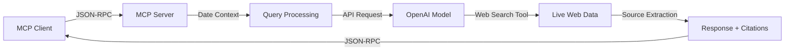

# OpenAI Web Search MCP Server

[](https://opensource.org/licenses/MIT)
[](https://nodejs.org/)
[](https://openai.com/)

An MCP (Model Context Protocol) server that connects OpenAI models with real-time web search capabilities. This implementation allows AI models to access current information from the web while maintaining proper source attribution.

## Features

- **Web Search Integration**: Connects OpenAI models with live web search functionality
- **Current Information Access**: Retrieves up-to-date information for time-sensitive queries
- **Source Attribution**: Automatically includes source URLs and titles in responses
- **Minimal Implementation**: Straightforward codebase with minimal dependencies
- **MCP Compliance**: Implements the Model Context Protocol specification
- **Date Context**: Automatically includes current date information in queries

## Technical Overview

### Architecture
This server implements a simple but effective architecture:
- Single-file implementation in [`index.js`](index.js)
- Node.js runtime with ES modules
- JSON-RPC communication over stdio transport
- OpenAI API integration with web search tools
- Environment-based configuration

### Technology Stack
- **Runtime**: Node.js 18+
- **Protocol**: MCP JSON-RPC over stdio
- **AI Integration**: OpenAI API with latest models
- **Search**: Web search tool integration
- **Authentication**: Environment variable configuration

### Data Flow


## Installation

### Prerequisites
- Node.js 18.0.0 or higher
- OpenAI API key

### Setup

1. **Clone the repository**
   ```bash
   git clone <repository-url>
   cd openai_with_search_grounding
   npm install
   ```

2. **Configure your API key**
   ```bash
   cp .env.example .env
   # Edit .env and add your OpenAI API key
   ```

3. **Test the installation**
   ```bash
   node index.js
   ```
   You should see: `OpenAI MCP server running`

## MCP Client Configuration

### Basic Configuration
Add this to your MCP client configuration file:

```json
{
  "mcpServers": {
    "openai-grounded-search": {
      "command": "node",
      "args": ["/absolute/path/to/openai_with_search_grounding/index.js"],
      "env": {
        "OPENAI_API_KEY": "sk-your_openai_api_key_here"
      }
    }
  }
}
```

### Client-Specific Paths

**Claude Desktop (macOS)**:
```
~/Library/Application Support/Claude/claude_desktop_config.json
```

**Roo/Cline (VS Code)**:
```bash
# macOS
~/Library/Application Support/Code/User/globalStorage/rooveterinaryinc.roo-cline/settings/mcp_settings.json

# Windows
%APPDATA%\Code\User\globalStorage\rooveterinaryinc.roo-cline\settings\mcp_settings.json

# Linux
~/.config/Code/User/globalStorage/rooveterinaryinc.roo-cline/settings/mcp_settings.json
```

## Usage

### Available Tool

**`grounded_search`** - Search with web context

**Parameters:**
- `query` (string, required): Search query for current information

**Example Tool Call:**
```json
{
  "method": "tools/call",
  "params": {
    "name": "grounded_search",
    "arguments": {
      "query": "latest developments in AI technology January 2025"
    }
  }
}
```

**Response Format:**
```
Today's date: 2025-01-25
Query: latest developments in AI technology January 2025

[Model response with current information and analysis]

**Sources:**
1. Tech News Site - https://example.com/tech-news
2. Industry Report - https://example.com/industry-report
```

### Key Capabilities
- **Date Awareness**: Automatically includes current date for temporal context
- **Source Tracking**: Provides URLs and titles for referenced sources
- **Current Data**: Accesses real-time web information
- **Model Integration**: Works with OpenAI's latest models

## Development

### Project Structure
```
openai_with_search_grounding/
├── LICENSE               # MIT License
├── README.md            # Documentation
├── package.json         # Node.js dependencies
├── package-lock.json    # Dependency versions
├── index.js            # Main MCP server implementation
├── .env.example        # Environment configuration template
├── .gitignore          # Git ignore rules
└── test-openai.js      # Testing script
```

### Testing

**Server Test:**
```bash
export OPENAI_API_KEY="sk-your_key_here"
node index.js
```

**API Test:**
```bash
node test-openai.js "your test query"
```

**Integration Test:**
1. Configure your MCP client
2. Use the `grounded_search` tool with a current events query
3. Verify the response includes recent information and sources

### Verification Steps
- [ ] Server starts without errors
- [ ] OpenAI API authentication works
- [ ] Tool is discoverable by MCP client
- [ ] Queries return current information
- [ ] Sources are properly formatted
- [ ] Date context is included

## Configuration

### API Key Setup
The server requires an OpenAI API key. You can configure this in several ways:

**Local Development:**
```bash
cp .env.example .env
# Edit .env file with your API key
```

**Production:**
```bash
export OPENAI_API_KEY="sk-your_openai_api_key_here"
```

### Security Notes
- Never commit API keys to version control
- Use environment variables for API key storage
- Monitor your API usage and set appropriate limits
- Rotate API keys regularly

## Troubleshooting

### Common Issues

**Authentication Problems:**
```bash
# Verify your API key format
echo $OPENAI_API_KEY | grep "^sk-"

# Test API connectivity
curl https://api.openai.com/v1/models \
  -H "Authorization: Bearer $OPENAI_API_KEY"
```

**Model Access:**
- Ensure your account has access to the required models
- Check your OpenAI account billing status
- Verify model availability in your region

**MCP Connection:**
- Double-check the absolute path to `index.js`
- Ensure Node.js version is 18 or higher
- Verify environment variables are set correctly

### Debug Mode
```bash
OPENAI_API_KEY=your-key node index.js 2>&1 | tee debug.log
```

### Resources
- [OpenAI API Documentation](https://platform.openai.com/docs)
- [MCP Protocol Specification](https://spec.modelcontextprotocol.io/)
- [OpenAI Status Page](https://status.openai.com/)

## Contributing

Contributions are welcome. Please follow these guidelines:

1. Fork the repository
2. Create a feature branch
3. Make your changes
4. Test thoroughly
5. Submit a pull request

### Code Guidelines
- Follow the existing code style
- Keep dependencies minimal
- Add tests for new features
- Update documentation as needed

## Technical Details

### Implementation
- **API Integration**: Uses OpenAI's response API with web search tools
- **Model**: Compatible with OpenAI's latest models
- **Web Search**: Integrated web search functionality
- **Output**: Configurable token limits (default: 1500 tokens)
- **Transport**: Standard MCP JSON-RPC over stdio

### Performance
- **Startup**: ~100ms initialization time
- **Response**: 3-15 seconds depending on query complexity
- **Memory**: ~50MB base usage
- **Concurrency**: Single-threaded stdio transport

## License

This project is licensed under the MIT License - see the [LICENSE](LICENSE) file for details.

## Technical Implementation

This project demonstrates:
- **Clean Architecture**: Minimal, maintainable codebase
- **API Integration**: Proper OpenAI API usage patterns
- **Protocol Compliance**: Full MCP specification implementation
- **Security Practices**: Safe API key handling
- **Documentation**: Clear, comprehensive documentation

Suitable for developers building AI applications, implementing MCP servers, or integrating web search with language models.

---

**Version**: 1.0.0  
**Node.js**: 18+  
**MCP Protocol**: 1.0.1  
**OpenAI Integration**: Latest Models