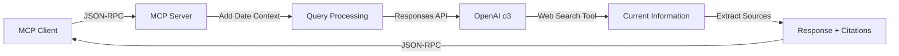

# OpenAI o3 + Web Search MCP Server

A minimal MCP (Model Context Protocol) server that exposes OpenAI's o3 reasoning model with Web Search grounding as a single tool for real-time information retrieval.

## Features

- **Advanced Reasoning**: Leverages OpenAI's o3 model with sophisticated reasoning capabilities
- **Real-time Web Search**: Access current information via integrated web search grounding
- **Source Citations**: Automatically extracts and formats source URLs from search results
- **Automatic Date Context**: Dynamically includes today's date in all queries
- **Zero-bloat Architecture**: Just 151 lines of code, 2 dependencies, no build process
- **Professional MCP Protocol**: Full compliance with MCP JSON-RPC over stdio

## Quick Start

```bash
# Clone and install
git clone <repository-url>
cd openai_with_search_grounding
npm install

# Set up OpenAI API key
export OPENAI_API_KEY="your-openai-api-key"

# Test the server
node index.js
```

## Installation

### Prerequisites
- Node.js 18.0.0 or higher
- OpenAI API key with access to o3 model

### Setup Steps

1. **Install Dependencies**
   ```bash
   npm install
   ```

2. **Configure OpenAI API Key**
   ```bash
   # Set your OpenAI API key
   export OPENAI_API_KEY="your-openai-api-key"
   ```

3. **Optional: Create .env file**
   ```bash
   echo "OPENAI_API_KEY=your-openai-api-key" > .env
   ```

## Configuration

### Environment Variables

| Variable | Required | Default | Description |
|----------|----------|---------|-------------|
| `OPENAI_API_KEY` | Yes | - | Your OpenAI API key with o3 model access |

### MCP Client Configuration

Add to your MCP client settings (e.g., Roo/Cline):

```json
{
  "mcpServers": {
    "openai-o3-grounded-search": {
      "command": "node",
      "args": ["/path/to/openai_with_search_grounding/index.js"],
      "env": {
        "OPENAI_API_KEY": "your-openai-api-key"
      }
    }
  }
}
```

**Example Roo/Cline Configuration Path:**
`/Users/username/Library/Application Support/Code/User/globalStorage/rooveterinaryinc.roo-cline/settings/mcp_settings.json`

## Usage

### Available Tool

**`grounded_search`** - Search for current information using OpenAI o3 with Web Search grounding

**Parameters:**
- `query` (string, required): Search query for current information

**Example Usage:**
```javascript
// Through MCP client
{
  "method": "tools/call",
  "params": {
    "name": "grounded_search",
    "arguments": {
      "query": "latest AI developments 2025"
    }
  }
}
```

**Response Format:**
- Main response text with reasoning and analysis
- Automatically appended source citations with titles and URLs
- Date context automatically included in queries

### Example Response

```
Today's date: 2025-07-17
Query: latest AI developments 2025

[Detailed response with reasoning and current information]

**Sources:**
1. AI News Today - https://example.com/ai-news
2. Tech Industry Report - https://example.com/tech-report
```

## Requirements

### OpenAI API Setup

1. **Get OpenAI API Key**
   - Visit [OpenAI Platform](https://platform.openai.com/)
   - Create an account or sign in
   - Generate an API key with o3 model access

2. **Verify Model Access**
   - Ensure your account has access to the o3-2025-04-16 model
   - Check your API usage limits and billing setup

### Dependencies

```json
{
  "@modelcontextprotocol/sdk": "^1.0.1",
  "openai": "^4.73.0"
}
```

## Testing

### Manual Testing

1. **Start the server directly:**
   ```bash
   node index.js
   ```
   Should output: `OpenAI o3 MCP server running`

2. **Test with MCP client:**
   - Configure your MCP client with the server
   - Call the `grounded_search` tool with a current events query
   - Verify the response includes recent information and source citations

### Verification Steps

- [ ] Server starts without errors
- [ ] OpenAI API authentication works
- [ ] Tool is discoverable by MCP client
- [ ] Queries return current information with sources
- [ ] Date context is automatically included
- [ ] Source citations are properly formatted

## Architecture

### Design Philosophy
**Ultra-minimal MVP approach** - Deliberately simple with zero bloat:
- Single file implementation (`index.js` - 151 lines)
- No TypeScript compilation step
- No build process required
- Two dependencies only

### Technical Stack
- **Runtime**: Node.js with ES modules
- **Protocol**: MCP JSON-RPC over stdio transport
- **AI Service**: OpenAI o3 (o3-2025-04-16)
- **API**: OpenAI Responses API (not Chat Completions)
- **Authentication**: OpenAI API key

### Data Flow


### Core Components

1. **MCP Server Setup** (lines 76-87)
2. **Tool Definition** (lines 90-103)
3. **OpenAI Integration** (lines 11-25, 45-74)
4. **Source Extraction** (lines 28-42)
5. **Request Handlers** (lines 106-132)

### Technical Specifications

- **API Used**: OpenAI Responses API (`client.responses.create()`)
- **Model**: `o3-2025-04-16` with medium reasoning effort
- **Web Search Integration**: `tools: [{ type: 'web_search' }]`
- **Source Extraction**: From `response.output` annotations with `url_citation` type
- **Date Context**: Automatic injection via prompt preprocessing
- **Max Tokens**: 1200 output tokens per request

## Troubleshooting

### Common Issues

**1. "OPENAI_API_KEY environment variable is required"**
```bash
export OPENAI_API_KEY="your-openai-api-key"
```

**2. "OpenAI API error: Permission denied"**
- Verify your API key is valid and active
- Ensure you have access to the o3 model
- Check your OpenAI account billing status

**3. "OpenAI API error: Model not found"**
- Confirm o3-2025-04-16 model is available in your region
- Check OpenAI platform for model availability updates
- Verify your account has o3 model access

**4. MCP client can't connect**
- Verify the path to `index.js` in MCP configuration
- Check Node.js version (requires 18+)
- Ensure `OPENAI_API_KEY` is set in MCP config environment

**5. "Failed to initialize OpenAI client"**
- Check API key format (should start with 'sk-')
- Verify network connectivity to OpenAI API
- Test API key with a simple curl request

### Debug Mode

Run with error logging:
```bash
OPENAI_API_KEY=your-key node index.js 2>&1 | tee debug.log
```

### API Testing

Test your OpenAI API key:
```bash
curl https://api.openai.com/v1/models \
  -H "Authorization: Bearer $OPENAI_API_KEY"
```

### Support

For issues:
1. Check [OpenAI Status Page](https://status.openai.com/) for service status
2. Verify your OpenAI account dashboard for API limits
3. Review OpenAI documentation for o3 model specifics
4. Check MCP client logs for connection errors

## Project Structure

```
openai_with_search_grounding/
├── package.json           # Dependencies and scripts
├── package-lock.json      # Dependency lock file
├── index.js              # Complete MCP server (151 lines)
├── .env                  # Environment variables (optional)
├── .gitignore            # Git ignore patterns
└── README.md             # This documentation
```

### File Details

- **`index.js`**: Complete MCP server implementation with OpenAI o3 integration
- **`package.json`**: Project metadata and OpenAI dependency
- **`.env`**: Optional environment configuration for local development

---

**Status**: ✅ Fully functional with OpenAI o3  
**Last Updated**: July 2025  
**MCP Protocol Version**: 1.0.1  
**OpenAI Model**: o3-2025-04-16