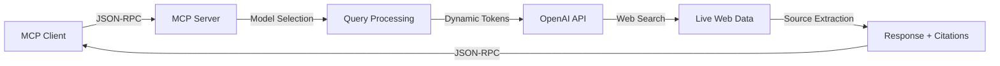

# OpenAI Multi-Model MCP Server with Web Search Grounding

[](https://opensource.org/licenses/MIT)
[](https://nodejs.org/)
[](https://openai.com/)

A powerful MCP (Model Context Protocol) server that connects OpenAI's latest models (O3, GPT-5 family) with real-time web search capabilities. This implementation provides dynamic token limits, flexible reasoning effort levels, and robust timeout handling for production use.

## 🚀 Key Features

- **Multi-Model Support**: Access to O3, GPT-5, GPT-5-mini, and GPT-5-nano models
- **Web Search Integration**: Real-time web search grounding for current information
- **Dynamic Token Limits**: Automatic scaling based on reasoning effort (4k/8k/16k tokens)
- **Flexible Reasoning Effort**: Low, medium, and high reasoning levels for different use cases
- **Robust Timeout Handling**: Configurable timeouts with proper error recovery
- **Source Attribution**: Automatic citation of web sources with URLs and titles
- **Production Ready**: Comprehensive error handling and performance optimizations

## 📋 Supported Models

| Model | Description | Best For |
|-------|-------------|----------|
| **O3-2025-04-16** | Latest reasoning model with advanced capabilities | Complex reasoning, analysis, and problem-solving |
| **GPT-5** | Full-scale GPT-5 model | General purpose, high-quality responses |
| **GPT-5-mini** | Efficient GPT-5 variant | Balanced performance and speed |
| **GPT-5-nano** | Lightweight GPT-5 variant | Fast responses, simple queries |

## 🎯 Token Limits by Reasoning Effort

| Reasoning Effort | Token Limit | Use Case |
|-----------------|-------------|----------|
| **Low** | 4,000 tokens | Quick searches, simple queries |
| **Medium** | 8,000 tokens | Detailed research, comprehensive answers |
| **High** | 16,000 tokens | In-depth analysis, complex topics |

## 🛠️ Installation

### Prerequisites
- Node.js 18.0.0 or higher
- OpenAI API key with access to GPT-5 and O3 models
- npm or yarn package manager

### Quick Setup

1. **Clone the repository**
   ```bash
   git clone <repository-url>
   cd openai_with_search_grounding
   ```

2. **Install dependencies**
   ```bash
   npm install
   ```

3. **Configure environment**
   ```bash
   cp .env.example .env
   # Edit .env and add your OpenAI API key
   ```

4. **Test the installation**
   ```bash
   node index.js
   ```
   You should see: `OpenAI Multi-Model MCP server with web search grounding running`

## ⚙️ Configuration

### Environment Variables

Create a `.env` file with:
```env
OPENAI_API_KEY=sk-your_openai_api_key_here
```

### MCP Client Configuration

Add to your MCP client configuration:

```json
{
  "mcpServers": {
    "openai-multi-model-grounded-search": {
      "command": "node",
      "args": ["/absolute/path/to/openai_with_search_grounding/index.js"],
      "env": {
        "OPENAI_API_KEY": "sk-your_openai_api_key_here"
      }
    }
  }
}
```

### Client-Specific Paths

**Claude Desktop (macOS)**:
```
~/Library/Application Support/Claude/claude_desktop_config.json
```

**Roo/Cline (VS Code)**:
```bash
# macOS
~/Library/Application Support/Code/User/globalStorage/rooveterinaryinc.roo-cline/settings/mcp_settings.json

# Windows
%APPDATA%\Code\User\globalStorage\rooveterinaryinc.roo-cline\settings\mcp_settings.json

# Linux
~/.config/Code/User/globalStorage/rooveterinaryinc.roo-cline/settings/mcp_settings.json
```

### Timeout Configuration

The server includes configurable timeouts for different scenarios. See [TIMEOUT_CONFIGURATION.md](TIMEOUT_CONFIGURATION.md) for detailed timeout settings and customization options.

## 📖 Usage

### Available Tool

**`grounded_search`** - Search for current information using OpenAI models with web search grounding

**Parameters:**
- `query` (string, required): Search query for current information
- `model` (string, optional): Model to use - "gpt-5", "gpt-5-mini", "gpt-5-nano", "o3-2025-04-16" (default: "o3-2025-04-16")
- `reasoning_effort` (string, optional): Reasoning effort level - "low", "medium", "high" (default: "low")

### Usage Examples

#### Basic Search (O3 with low effort)
```json
{
  "method": "tools/call",
  "params": {
    "name": "grounded_search",
    "arguments": {
      "query": "latest AI developments in 2025"
    }
  }
}
```

#### Complex Analysis (O3 with high effort)
```json
{
  "method": "tools/call",
  "params": {
    "name": "grounded_search",
    "arguments": {
      "query": "comprehensive analysis of quantum computing breakthroughs in 2025",
      "model": "o3-2025-04-16",
      "reasoning_effort": "high"
    }
  }
}
```

#### Quick Response (GPT-5-nano)
```json
{
  "method": "tools/call",
  "params": {
    "name": "grounded_search",
    "arguments": {
      "query": "current weather in San Francisco",
      "model": "gpt-5-nano",
      "reasoning_effort": "low"
    }
  }
}
```

#### Balanced Search (GPT-5-mini with medium effort)
```json
{
  "method": "tools/call",
  "params": {
    "name": "grounded_search",
    "arguments": {
      "query": "explain the latest developments in renewable energy",
      "model": "gpt-5-mini",
      "reasoning_effort": "medium"
    }
  }
}
```

### Response Format
```
Today's date: 2025-01-25
Query: [your query]
Model: [selected model]
Reasoning Effort: [selected effort level]

[Comprehensive response with current information]

**Sources:**
1. Source Title - https://example.com/article
2. Another Source - https://example.com/research
```

## 🔧 Troubleshooting

### Common Issues

**1. Authentication Errors**
```bash
# Verify API key format
echo $OPENAI_API_KEY | grep "^sk-"

# Test API connectivity
curl https://api.openai.com/v1/models \
  -H "Authorization: Bearer $OPENAI_API_KEY"
```

**2. Model Access Issues**
- Ensure your OpenAI account has access to GPT-5 and O3 models
- Check your API usage limits and billing status
- Verify model availability in your region

**3. Timeout Errors**
- For long-running queries, use higher reasoning effort levels
- Check [TIMEOUT_CONFIGURATION.md](TIMEOUT_CONFIGURATION.md) for timeout adjustments
- Monitor your network connection stability

**4. MCP Connection Problems**
- Verify the absolute path to `index.js` is correct
- Ensure Node.js version is 18 or higher
- Check that environment variables are properly set

### Debug Mode
```bash
# Run with debug output
OPENAI_API_KEY=your-key node index.js 2>&1 | tee debug.log

# Test specific model
node test-openai.js "your query" "gpt-5-mini" "medium"
```

## 🏗️ Architecture

### System Overview


### Key Components
- **Model Router**: Intelligently selects appropriate model based on query
- **Token Manager**: Dynamically adjusts token limits based on reasoning effort
- **Timeout Handler**: Manages request timeouts with graceful fallbacks
- **Source Extractor**: Parses and formats web search citations

## 📊 Performance Optimizations

See [PERFORMANCE_OPTIMIZATIONS.md](PERFORMANCE_OPTIMIZATIONS.md) for detailed performance tuning guidelines.

### Quick Tips
- Use GPT-5-nano for simple, fast queries
- Select appropriate reasoning effort to balance quality and speed
- Monitor token usage to optimize costs
- Implement caching for frequently requested information

## 🚀 Deployment

For production deployment guidelines, see [DEPLOYMENT_GUIDE.md](DEPLOYMENT_GUIDE.md).

### Key Considerations
- Secure API key management
- Rate limiting implementation
- Error monitoring and logging
- Horizontal scaling options

## 🤝 Contributing

Contributions are welcome! Please:

1. Fork the repository
2. Create a feature branch (`git checkout -b feature/amazing-feature`)
3. Commit your changes (`git commit -m 'Add amazing feature'`)
4. Push to the branch (`git push origin feature/amazing-feature`)
5. Open a Pull Request

### Development Guidelines
- Maintain backward compatibility
- Add tests for new features
- Update documentation
- Follow existing code style

## 📄 License

This project is licensed under the MIT License - see the [LICENSE](LICENSE) file for details.

## 🔗 Resources

- [OpenAI API Documentation](https://platform.openai.com/docs)
- [MCP Protocol Specification](https://spec.modelcontextprotocol.io/)
- [OpenAI Model Overview](https://platform.openai.com/docs/models)
- [Web Search API Documentation](https://platform.openai.com/docs/guides/web-search)

## 📈 Version History

- **1.2.0** - Full GPT-5 support with dynamic token limits
- **1.1.0** - Added O3 model and reasoning effort levels
- **1.0.0** - Initial release with basic web search grounding

---

**Current Version**: 1.2.0  
**Node.js**: 18+  
**MCP Protocol**: 1.0.1  
**Supported Models**: O3-2025-04-16, GPT-5, GPT-5-mini, GPT-5-nano